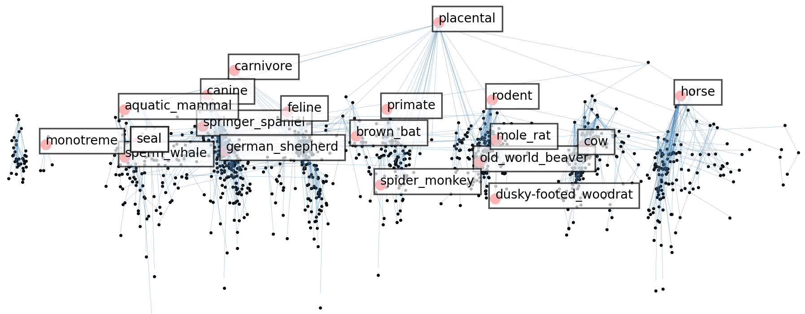

# Shadow Cones



This repository contains official implementation of the paper
[Shadow Cones: Unveiling Partial Orders in Hyperbolic Space](https://arxiv.org/abs/2305.15215).
Some of our code in data loading part is adopted from [hyperbolic_cones](https://github.com/dalab/hyperbolic_cones).

### Dependencies
Our implementation works with Python>=3.9 and PyTorch>=1.12.1. We use [HTorch](https://github.com/ydtydr/HTorch)
for optimization within hyperbolic space of different models. Please refer to HTorch repo for installation.
To install other dependencies, use: `$ pip install -r requirement.txt`

### Data
We provide the WordNet datasets (mammal and noun) under `data_utils/data/maxn/`, which
corresponds to [entailment cone](https://github.com/dalab/hyperbolic_cones/tree/master/data/maxn).
Due to space limit, ConceptNet and hearst datasets are stored on Google Drive. Please download 
with `gdown` and move them to `data_utils/data/MCG` and `data_utils/data/hearst`:
```python
pip install gdown
gdown --no-check-certificate --folder https://drive.google.com/drive/folders/1WH2LIk2EsTe_lQ03AjCaxZ3o8fSkNt1f?usp=sharing
```

### Usage
We use `train.py` to train on small datasets (e.g., mammal.) with single process, and `train_hogwild_lazy.py` to
train on large datasets (e.g., noun, MCG and hearst) with multi-processing. We provide commands and
hyper-parameter guideline in `run.sh`, for training different shadow cones on specified datasets.
```python
bash run.sh
```

### Authors

 - [Tao Yu*](https://www.cs.cornell.edu/~tyu/), tyu@cs.cornell.edu
 - Toni J.B. Liu*, jl3499@cornell.edu
 - [Albert Tseng](https://tsengalb99.github.io), albert@cs.cornell.edu
 - [Christopher De Sa](https://www.cs.cornell.edu/~cdesa/), cdesa@cs.cornell.edu

### Cite us

If you find our works helpful in your research, please consider citing us:

    @article{yu2023shadow,
      title={Shadow Cones: Unveiling Partial Orders in Hyperbolic Space},
      author={Yu, Tao and Liu, Toni JB and Tseng, Albert and De Sa, Christopher},
      journal={arXiv preprint arXiv:2305.15215},
      year={2023}
    }